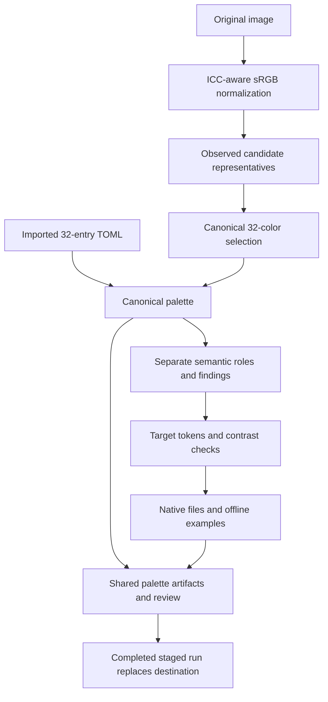

# Pipeline outputs and exporter reference

SVG gallery environment: the page, cards, text, links and focus outlines use fixed neutral colors independent of every theme. Palette-derived backgrounds remain inside the SVG compositions. Surrounding pages may use any background. Fresh preview: [neutral SVG gallery](../pilot/svg-neutral-gallery-2026-10-09/svg/examples.html). Earlier galleries remain historical previews.

Source review: **2026-10-09**. Engine/package version: **0.1.0**. This reference describes the current implementation, including the later syntax, chart and SVG improvements. It inventories generated files, explains their construction, and identifies application acceptance limits. Dated acceptance records remain evidence for their particular artifacts; they do not automatically cover newly generated files.

Read alongside [commands](COMMAND-CONTRACT.md), [testing](TESTING-REFERENCE.md), [editor contracts](EDITOR-TARGETS.md), [PowerPoint](POWERPOINT.md), [visual contracts](VISUAL-TARGETS.md) and [hosting operations](HOSTING.md). The implementation links below are relative to this repository so they remain usable offline.

## Contents

- [Scope and target inventory](#scope-and-target-inventory)
- [Shared generation process](#shared-generation-process)
- [Shared files and data contracts](#shared-files-and-data-contracts)
- [Application and format contracts](#application-and-format-contracts)
- [Independent asset utilities](#independent-asset-utilities)
- [Dependencies, packaging and delivery](#dependencies-packaging-and-delivery)
- [Extension and recovery rules](#extension-and-recovery-rules)

## Scope and target inventory

`apt-theme generate` starts from an image; `apt-theme import` starts from a 32-entry palette. Both run the same semantic mapping, adaptation, export and reporting stages. All ten IDs in [`DEFAULTS`](../apt_theme/targets.py) are selected by default. `--targets` accepts a comma-separated, unique subset of those exact IDs. Unsupported or duplicate IDs fail before export.

Here `<slug>` means the supplied name, lowercased, with runs of non-ASCII-alphanumeric characters replaced by hyphens and leading/trailing hyphens removed. An empty result becomes `aptlantis-theme`. Without `--name`, the input filename stem supplies the name. Each target has its own directory under the chosen run directory.

| App/type | Target ID | Default token budget | Current default named count | Primary output |
|---|---|---:|---:|---|
| Windows Terminal | `windows_terminal` | 20 | 20 | `windows-terminal.json` color scheme |
| SiYuan | `siyuan` | 64 | 62 | Dark theme folder and `package.zip` |
| Typora | `typora` | 40 | 40 | `<slug>.css` |
| PowerPoint / Office colors | `powerpoint` | 24 | 22 | `<slug>.xml`, editable PPTX, reusable POTX |
| Alacritty | `alacritty` | 20 | 20 | `<slug>.toml` |
| Notepad++ | `notepad_plus_plus` | 32 | 30 | `<slug>.xml` |
| Sublime Text 4 | `sublime_text` | 40 | 30 | `<slug>.sublime-color-scheme` |
| Editable vector examples | `svg` | 40 | 28 | Six SVG compositions and gallery |
| Offline Prism syntax examples | `syntax_highlighting` | 32 | 30 | CSS, twelve pages, sources and runtime |
| Data visualization / Matplotlib | `data_visualization` | 48 | 37 | Style, scales, fixture, three authored SVG charts |

Budgets cap **named tokens**, not unique RGB colors, application fields, file counts or canonical palette size. Aliases are expected; an image with narrow hues cannot supply conventional red/green/blue distinctions without breaking the image-color rule. Exporters do not pad unused budget with arbitrary tokens. The first four application targets are not the only targets selected by default.

ICO conversion, SVG raster wrapping/tracing and atlas generation are separate commands, described below. They are not theme target IDs. SESM metadata belongs to the independently governed sibling project. Historical JetBrains/language-template artifacts and the project overview deck are not current `apt-theme` exporters. The local/hosted collection index is maintained separately; generation does not refresh it or publish a run.

## Shared generation process

### 1. Input and normalization

[`cli.build`](../apt_theme/cli.py) resolves the source and destination, validates configuration/targets, and checks destination safeguards. Image extraction in [`extraction.extract`](../apt_theme/extraction.py) hashes the original input, identifies its first frame, rejects unprofiled CMYK, applies auto-orientation and an sRGB ICC profile, then asks ImageMagick for 8-bit RGBA pixels. These normalized pixels are analysis data; the original image file is copied intact into the run.

Fully transparent pixels are excluded. Partial opacity contributes `alpha / 255` population weight. If more than 65,536 visible pixels remain, the default seeded sampler chooses that many without replacement. The defaults are seed 32 and up to 192 candidate clusters; configuration permits a sample limit of at least 32 and candidate counts from 32 through 1,024. Fewer than 32 distinct sampled visible RGB colors is an error, not a request to invent colors.

Unique sampled RGB values become OKLab coordinates. Weighted scikit-learn KMeans uses three initializations and up to 100 iterations, with numerical worker threads limited to one. Each cluster contributes the observed RGB value nearest its center, carrying the cluster's population weight. A center is never directly emitted as a new canonical color. Input SHA-256 is checked again after extraction.

### 2. Canonical selection or import

[`select`](../apt_theme/extraction.py) starts with the darkest and lightest candidates and a 30-cluster weighted KMeans pass. It takes unused observed representatives near centers when their separation from selected colors is at least 0.03 OKLab distance, then fills remaining slots using population-weighted farthest candidates. The result is exactly 32 colors, ordered by lightness and hex, named `color_01` through `color_32`.

Near-black candidates with every sRGB byte at most 12 collapse to one observed darkest anchor only when at least 32 representatives would remain. Their weights are combined; the anchor's RGB is unchanged. Sparse/exact inputs retain their observed colors. This avoids spending several slots on barely visible black noise.

Import bypasses image sampling and selection. [`load_palette`](../apt_theme/extraction.py) accepts UTF-8 with or without BOM, current `[palette.canonical]` and older grouped palette tables, and exactly 32 entries. Hex takes precedence over RGB, which takes precedence over OKLCH. RGB must contain three integer bytes. IDs must be unique and legacy role references must resolve. A declared light variant is rejected. Imported IDs and authoritative hex/RGB values are retained; numeric color representations are recalculated and TOML is reserialized. The original input TOML bytes remain in `source/`.

Deterministic behavior is tested within the recorded environment. Changes in numeric libraries, extraction settings or selection code can change image-selected IDs; recheck ID-based overrides on a fresh revision. Import is the route for keeping a reviewed canonical palette while improving downstream mappings.

### 3. Semantic role assignment

[`semantics.assign`](../apt_theme/semantics.py) maps role names to canonical IDs, without editing canonical values. Default background policy prefers an observed dark chromatic surface in OKLCH lightness 0.12–0.32 and chroma at least 0.015, balancing distance from target lightness 0.20, chroma and population. It falls back to a dark neutral or darkest color with a finding. `background_mode = "darkest"` explicitly selects the darkest policy; `background_lightness` must be 0.12–0.32.

Foreground maximizes contrast against the chosen background. Primary emphasizes population and chroma; secondary is perceptually distant from primary. Muted seeks roughly 4.5 contrast. Selection uses primary; cursor uses secondary. ANSI black retains the darkest anchor independently of the application surface.

Status and ANSI roles seek conventional hues among available chromatic colors, with a lightness preference. Hue targets include warning 85°, error/red 30°, success/green 145°, info 230°, yellow 95°, blue 265°, magenta 325° and cyan 205°. A distance above 35° produces an `unavailable_conventional_hue` finding. Seven syntax roles are chosen for perceptual separation/readability; comment reuses muted. Reused status sources produce `semantic_collision` findings. `[overrides]` may select an existing canonical ID for an existing role; invalid roles/IDs fail. A background override is applied early so foreground selection responds to it.

These findings describe suitability. They do not cause new conventional hues to be synthesized, and semantic findings alone do not cause strict-mode failure.

### 4. Adaptation, derivation and checks

[`targets.adapt`](../apt_theme/targets.py) creates fresh token dictionaries. [`colors.derive`](../apt_theme/colors.py) changes OKLCH lightness/chroma while retaining requested hue. Out-of-sRGB colors undergo 36-step chroma bisection at fixed lightness/hue, followed by byte rounding. `readable` first retains a passing source, otherwise raises lightness in 0.01 steps, ending at 0.99 if necessary. Rounded RGB can slightly alter measured hue; requested values and gamut mapping are recorded.

The common nonterminal base has 22 tokens: background, foreground, panel, elevated, muted, primary, secondary, selection, selection_text, border; warning/error/success/info; keyword/string/number/function/type/operator/constant/comment. Panel/elevated are derived from the background. Text normally targets 4.5:1, boundaries and diagram marks 3:1. General text adjustment considers the lightest exported surface, and checks also record text against panel/elevated. Selection text is checked against selection. Terminal handling is separate, described below.

Minimum mandatory counts are 20 for terminals, 22 for the other base targets, 28 for SVG and 37 for data visualization. A smaller budget is rejected. Editor/syntax targets add up to eight variants: invalid, diff_added, diff_deleted, diff_changed, tag, attribute, escape, label. SiYuan/Typora add up to 18 state variants across six roles and hover/pressed/subdued; SiYuan adds up to 22 text-on-panel/elevated variants. Optional variants stop when the budget is reached. Defaults do not always consume the full budget.

Checks apply to declared final RGB pairs. They do not measure every possible overlapping object, translucent effect, terminal override, application selector, image or user-created slide. Derived tokens are separate from immutable canonical colors.

### 5. Staging and completion

All output is built in a sibling temporary directory. Source copying is hash-checked. Export/report failure leaves an existing run intact. Completed replacement temporarily renames the old run, restores it if the final rename fails, and removes the old revision after a successful replacement. This is a staged replacement with rollback, not a permanent backup or a documented power-loss/concurrent-writer guarantee.

Existing output requires `--overwrite`. A nonempty directory without `run.json` is refused even with that flag; this is a marker-based ownership guard, not cryptographic validation of a previous run. Output cannot contain the input. Use fresh dated directories to retain review history. Strict contrast failure returns exit 2 **after** completed artifacts are written for diagnosis; processing failure returns 1. Argparse also uses 2 for invalid syntax. See the [command contract](COMMAND-CONTRACT.md).

## Shared files and data contracts

The following are created for every completed run, regardless of the target subset.

| Path | Contents and purpose |
|---|---|
| `source/<original-name>` | Original input bytes, copied and SHA-256 checked |
| `palette.toml` | Theme name, dark variant, source hash, final_colors=32; canonical IDs with hex, RGB, OKLCH, weight |
| `palette.txt` | Tab-separated ID and hex per line |
| `palette.css` | Canonical `--apt-color-01`-style CSS custom properties; no application semantics |
| `palette.png` | Labeled Pillow swatch image, four columns; 1,024 pixels wide |
| `candidates.json` | Candidate colors/population data; on import, supplied colors |
| `selection.json` | Sampling/coverage/spacing or import diagnostics; background policy and optional comparison hash |
| `semantics.json` | `roles` maps role→canonical ID; `findings` explains suitability/fallback/collisions |
| `provenance.json` | Input SHA-256 and extraction details, or imported_palette identity and legacy roles |
| `review.html` | Offline report: source thumbnail for images, palette, diagnostics, candidates, semantics, target samples, origins, omissions, contrast and links |
| `run.json` | `aptlantis.theme-run.v1` summary: name, dark variant, source hash, target IDs, contrast_failures, semantic_findings, native acceptance pending, installation not performed |

`--compare` reads another palette. Image generation includes its sample coverage metrics; both routes record the comparison hash and report its swatches. It does not change the selected/imported palette. Coverage measures distance to normalized sampled pixels, not aesthetic quality.

Report chrome and labeled swatch annotations use fixed neutral/display colors in [`report.py`](../apt_theme/report.py). They are review UI, outside target token budgets; their paints are not additional canonical colors or theme hues. Application samples use the exported token values. SiYuan's thumbnail reuses this labeled swatch renderer, so thumbnail annotations likewise are not additional theme tokens.

Every target also writes:

| File | Fields |
|---|---|
| `tokens.json` | target, budget, named_count, unique_count, tokens, checks, omitted_canonical, aliases, contrast_failures, plus exporter-specific metadata |
| `validation.json` | checks, contrast_failures, native_visual_acceptance=`pending` |
| `apt-<language>-<output-type>-palette.toml` | dark theme, original-input SHA-256, transformation counts/order/aliases/omissions, grouped actual tokens, role references, complete source palette and declared checks |
| `apt-<language>-<output-type>-swatch.png` | 1,200-pixel-wide, four-column token preview; token name, exact hex, canonical/derived label and source ID |

Source: [`target_palette.py`](../apt_theme/target_palette.py). Both generation and import emit these artifacts for every selected target. `tokens.json.palette_artifacts` and `review.html` expose their filenames. The language portion uses the supplied theme name or input stem, lowercased and slugged, with one leading `Aptlantis-` or `apt-` removed; output type is the current target ID slugged with hyphens. Example: `Aptlantis-Clogure` + `notepad_plus_plus` produces `apt-clogure-notepad-plus-plus-palette.toml` and `apt-clogure-notepad-plus-plus-swatch.png` in `notepad_plus_plus/`.

The TOML schema is `aptlantis.target-palette.v1`. `palette.canonical` contains unchanged target tokens and `palette.derived` contains adapted tokens, keyed by token name rather than source ID. Each records exact RGB/hex/OKLCH and origin metadata. `source_palette.canonical` independently retains all 32 source IDs and values; `roles.tokens` references the target names. `transformation.token_order` matches PNG order and `tokens.json`, while actual_count counts named tokens and unique_hex_count counts distinct hex values. Aliases remain visible. This target document is not a canonical 32-color import input; use the run-root `palette.toml` for that command. Fixed preview annotations are review UI, outside the palette. SiYuan's native ZIP membership is unchanged; the new review artifacts sit beside it. Dated/public output runs are not automatically regenerated.

A token contains hex/RGB/OKLCH and `origin`: source canonical ID, purpose, requested_oklch, gamut_mapped and derived (final hex differs from source). Origin records explain derivation, not a new canonical identity. `aliases` groups token names sharing one hex; `omitted_canonical` lists source IDs not used by this adapter. Each check records foreground/background token names, ratio, required threshold and pass. Generated pending fields are conservative defaults; external dated native evidence may establish a narrower tested scenario without rewriting these artifacts.

For example, follow `semantics.json.roles.primary` into `palette.toml`, then `tokens.json.tokens.primary.origin`, then the native field using primary. In PowerPoint, primary supplies both `accent1` and `hlink`; those are two native fields using one target token. An omitted source color remains in the canonical palette even if that adapter does not use it.

## Application and format contracts

### Windows Terminal

Source: [`targets.export`](../apt_theme/targets.py). Files: `windows-terminal.json`, `tokens.json`, `validation.json`.

The native JSON contains 21 properties: name plus 20 colors. `background`/`foreground` are direct fields; cursor becomes `cursorColor`, selection becomes `selectionBackground`. Eight ANSI names (black, red, green, yellow, blue, magenta, cyan, white) and their `brightBlack` through `brightWhite` counterparts use corresponding tokens. Bright variants request up to 0.08 additional lightness, capped at 0.99; readable adjustment may produce aliases. Foreground and ANSI text target 4.5 against background, cursor 3 against background, and foreground 4.5 against selection.

The artifact is a color-scheme object for operator integration with Terminal settings, not a complete settings file, profile, font setup or installation. The HTML sample is a static ANSI swatch simulation. Native loading, selection/cursor behavior, terminal transparency and runtime application color overrides require their own acceptance record.

### SiYuan

Source: [`editor_css` and `export`](../apt_theme/targets.py). Files: `theme.css`, `theme.json`, `README.md`, `icon.png`, `preview.png`, `package.zip`, plus audit JSON.

`theme.css` declares all adapted `--apt-*` variables and maps dark-mode SiYuan `--b3-*` variables for backgrounds, surfaces, text, primary/secondary, error, border, code blocks, list hover/selection and font family. Selectors cover document body, docks/lists, dialogs, code blocks, links/headings, selection, blockquote borders, table/control borders and inputs. Eight `.hljs-*` classes consume syntax roles. `.apt-*` status/accent classes consume states; selected link/button/menu selectors use primary/secondary hover/active/subdued variants. When budget allows, scoped list/dialog syntax and text selectors consume panel/elevated variants.

Metadata declares slug name, display name, version 0.1.0, minAppVersion 3.7.0, modes `[dark]`, frontends `[all]`, and README/icon/preview paths. These are emitted declarations, not proof of compatibility with every frontend/version. Pillow creates the token swatch preview and a resized 160×160 icon. ZIP contains exactly the five theme files above, at its root, with fixed entry timestamps; audit JSON stays outside the theme ZIP.

The generated README describes manual placement in the workspace theme folder. Generation does not place it there. Selector coverage, settings/popup/search/editor states, mobile frontends, disabled states and SiYuan's own highlighting integration remain native review concerns. Packaging validity alone is not marketplace acceptance.

### Typora

Source: [`editor_css`](../apt_theme/targets.py). Files: `<slug>.css` and audit JSON.

Typora variables map background/text/sidebar/control foreground. Selectors cover body/#write, sidebar, fences/CodeMirror, modal/dropdown surfaces, Markdown headings/links, blockquotes, selection, borders and inputs. `#write` uses a 900px maximum width and padded readable text. CodeMirror classes map keyword→keyword, string→string, number→number, comment→comment, def→function, operator→operator, variable-2→type and atom→constant. Shared `.hljs-*` and status/state selectors are also emitted.

There is no Typora package ZIP, typography asset bundle or separate native preview file. The shared review is a simulation. The CSS does not claim exhaustive application chrome, all Markdown constructs, print/export styling or host-version acceptance. Manual theme loading and document/code/selection/sidebar review remain separate.

### PowerPoint and Office colors

Sources: [`targets.export`](../apt_theme/targets.py), [`powerpoint.py`](../apt_theme/powerpoint.py), [preserved template receipt](../apt_theme/templates/provenance.json). Files: `<slug>.xml`, `<slug>-sample.pptx`, `<slug>-template.potx`, `template-provenance.json`, audit JSON.

| Office color slot | Target token | Office color slot | Target token |
|---|---|---|---|
| dk1 | background | lt1 | foreground |
| dk2 | panel | lt2 | muted |
| accent1 | primary | accent2 | secondary |
| accent3 | keyword | accent4 | string |
| accent5 | number | accent6 | type |
| hlink | primary | folHlink | secondary |

The standalone XML is a DrawingML `a:clrScheme` with twelve `a:srgbClr` values. It is a color definition, not a full `.thmx` Office theme. The native PPTX/POTX include the supplied 23-slide presentation and 14 layouts; text, geometry, relationships, placeholders, notes, fonts, tables, charts and embedded workbooks are preserved as package parts. Template wording and chart values remain illustrative. Empty picture placeholders remain available for user content.

The reference `aptlantis-clogure-template.pptx` is packaged and must match SHA-256 `ff78bc0f960314d5301f3533a18fe65d1a45c6c24e4139ff84e52cc675b6595d`. Missing or changed bytes fail closed. Export replaces twelve color definitions in theme XML and converts exact explicit black/pale paints to dk1/lt1 scheme references in relevant parts. It refuses remaining unmapped explicit RGB colors outside themes. Narrow byte substitutions preserve namespace declarations/effects and avoid reconstructing native objects. Core-property timestamp QName declarations are validated. ZIP part order/timestamps are fixed. POTX differs from PPTX only in the main presentation content type.

`template-provenance.json` and `tokens.json.sample_deck` record filenames, counts, source hash, modified/preserved part counts, illustrative data and conservative pending status. Generation uses Python ZIP/XML, with no Node/Artifact Tool dependency. The retained `sample_deck.mjs` is earlier source, not the active exporter. Separate overview-deck authoring scripts have their own dependencies.

Recorded native PowerPoint opening/rendering with repair disabled exists in [template acceptance](../migration/powerpoint-template-acceptance.json). Manual edits, chart workbook round trips, creating a slide through every layout and save/reopen remain separate pending scenarios. Browser samples and declared token contrast cannot establish every slide's actual text/mark pairing. See [PowerPoint use and recovery](POWERPOINT.md).

### Alacritty

Source: [`targets.export`](../apt_theme/targets.py). Files: `<slug>.toml` and audit JSON. Token derivation/checks are the terminal rules above.

Five TOML groups are emitted: `colors.primary` background/foreground; `colors.cursor` text=background and cursor=cursor; `colors.selection` text=foreground and background=selection; `colors.normal` eight ANSI colors; `colors.bright` eight bright colors. `tokens.json.native_slots` records those mappings. Cursor text/background contrast is not an additional dedicated check in the current adapter.

Operator imports the file through the parent Alacritty configuration. Dim, search/hint and extended indexed colors are not exported; later configuration/runtime overrides can change behavior. Native loading and ANSI/cursor/selection review remain pending. Detailed operator paths and official contract links: [editor targets](EDITOR-TARGETS.md).

### Notepad++

Source: [`native_editors.export_editor`](../apt_theme/native_editors.py). Files: `<slug>.xml` and audit JSON.

XML uses `NotepadPlus`, `LexerStyles/LexerType/WordsStyle` and `GlobalStyles/WidgetStyle`. Explicit lexers are Python (21 styles), C++ (19) and JSON (14); other lexers are outside this export's coverage. Style IDs and names match the contract recorded in [editor documentation](EDITOR-TARGETS.md). Keyword classes preserve the host's keyword list routing. Every lexer style gets exported foreground and base background, with font fields left blank/default.

Python maps comments, numbers, string families including f-strings, keywords, class/function names, operators, builtins, decorators, attributes and invalid strings. C++ includes instructions/types, preprocessor, strings/raw/verbatim/regex, comments/doc comments and invalid doc keywords. JSON includes property names, escapes, comments, operators, URI/compact IRI, keywords and errors. Optional tag/attribute/escape/label/invalid/diff tokens fall back to their base roles when budget is limited.

Fifteen globals cover default style, indent guides, matching/bad braces, current line, selection, caret, line numbers, fold/margin, find statuses and modified/saved change history. `acceptance_limits` explicitly excludes other lexers and full application chrome. Selection foreground depends on Notepad++ `enableSelectFgColor.xml`; otherwise syntax text can retain its colors. Native import/style behavior is pending, including compatibility with the user's installed lexer versions.

### Sublime Text 4

Source: [`native_editors.export_editor`](../apt_theme/native_editors.py). Files: `<slug>.sublime-color-scheme` JSON and audit JSON.

Seventeen globals cover editor background/foreground, caret, line highlight, gutter/text, selection/text/border, inactive selection/text, find highlight/text, accent and added/deleted/modified line diffs. Sixteen scope rules map comments, strings, constants/numeric constants, keywords/operators, function/type/class names, tags, attributes, escapes, labels, invalid and markup inserted/deleted/changed. Each rule specifies a foreground; it does not replace installed syntax definitions.

Optional semantic variants fall back to error/success/warning or corresponding syntax roles. This is an editor **color scheme**, not a Sublime UI theme/package, syntax grammar or plugin. Scope matching depends on installed syntax packages. Native scheme loading, precedence and real-file behavior remain pending; [editor documentation](EDITOR-TARGETS.md) supplies operator guidance.

### SVG compositions

Sources: [`svg_examples.py`](../apt_theme/svg_examples.py), shared primitives in [`visual_targets.py`](../apt_theme/visual_targets.py). Files: six SVGs, `examples.html`, `examples.css`, audit JSON.

| File | Example use and vector features |
|---|---|
| `technical-flow.svg` | Detailed pipeline workflow, connectors, grouped process panels and annotations |
| `editorial-infographic.svg` | Editorial hierarchy, callouts, repeated visual elements and explanatory composition |
| `orbit-map.svg` | Relationship/network composition with curved connections and orbit structure |
| `icon-sheet.svg` | Twelve reusable local symbols with repeated icon instances |
| `wayfinding-map.svg` | Fictional labeled map, routes, landmarks and local pattern |
| `product-illustration.svg` | Detailed product/device illustration, clipped screen and tonal radial gradient |

Each composition has a 1200×800 viewBox, accessible title/description, named editable groups, local symbols/references, text and presentation-attribute paints. Six series tokens supplement the common base. Literal fill/stroke/gradient-stop colors are exported tokens; patterns and gradient opacity do not introduce new token hues. No scripts, rasters, animation, foreignObject or external reference is authored.

The gallery uses local image previews and exact-byte SVG downloads embedded as data URIs for reliable file-based use. `tokens.json.examples` names the six files. The editorial tile motif is conceptual repeated series coloring, not a rendering of all 32 distinct canonical swatches; the map is fictional/not to scale, and the product screen is an illustration, not a working interface. Decorative opacity/texture contrast is outside declared token checks. Chromium preview behavior is recorded; Illustrator/Inkscape/Office import, font substitution, editing, print/PDF and cross-renderer symbol/clip/pattern behavior remain unverified.

### Offline Prism syntax highlighting

Sources: [`syntax_examples.py`](../apt_theme/syntax_examples.py), [`PRISM` mapping](../apt_theme/visual_targets.py), [vendor manifest](../apt_theme/vendor/prism/manifest.json), [source manifest](../apt_theme/examples/syntax/manifest.json).

Files: `prism.css`, `examples.css`, `examples.html`, twelve `syntax-<grammar>.html` pages, `syntax-example.html`, `sources/*`, `vendor/prism/*`, audit JSON. HTML uses grammar ID `markup`; C# uses `csharp`; C++ uses `cpp`. The other pages are javascript, typescript, python, css, json, sql, bash, powershell and toml. The compatibility `syntax-example.html` is byte-identical to the JavaScript page.

Prism 1.30.0 core and required grammars are bundled with upstream license, tagged provenance, components metadata and SHA-256 manifest. `clike` and `c` supply required dependencies alongside the twelve example grammars. Generation checks vendor hashes, copies vendor/source files unchanged, escapes source into `<pre><code>`, and loads deferred local scripts in dependency order. The twelve source files each contain 25–50 lines plus language-specific explanations. Code is displayed, never evaluated by the generator or page. Download data URIs preserve original bytes, while browser text comparisons account for normal newline normalization.

CSS maps Prism comment/prolog/doctype/cdata to comment; punctuation/operator to operator; property/tag/boolean/constant/symbol to constant; number to number; selector/attr-name/builtin/class-name to type; string/char/attr-value to string; keyword/atrule to keyword; function to function; regex/important to primary; inserted/deleted to diff variants. Additional variables/parameters use foreground, namespace uses type, annotations/decorators use function, interpolation punctuation uses operator. Bold/italic conventions remain text styling. The exact source mapping is authoritative for all aliases.

Keyboard navigation links index/previous/next; focusable code panels contain horizontal scrolling. Without JavaScript, escaped readable code remains. Generation needs neither Node nor network. Browser evidence confirms token creation, representative computed colors, preserved source, no sample execution, navigation and narrow layout for the tested Chromium version. This is a local web highlighting bundle, not a universal IDE grammar/theme, LSP, compiler or proof that every sample executes correctly. No interpreter execution or host-site integration is implied.

### Data visualization and Matplotlib

Sources: [`chart_examples.py`](../apt_theme/chart_examples.py), [`visual_targets.py`](../apt_theme/visual_targets.py), optional [`render_matplotlib_examples.py`](../tools/render_matplotlib_examples.py).

Files: `<slug>.mplstyle`, `scales.json`, `example-data.json`, `bars.svg`, `lines.svg`, `heatmap.svg`, `heatmap-values.html`, `examples.html`, `examples.css`, audit JSON. Authored SVG canvases are 960×540 and generated directly from XML primitives. These files are not Matplotlib renders.

The style maps figure/savefig background, axes background/edge/labels, text, ticks, grid and legend surfaces/borders to exported tokens. A six-color/six-line-style cycle, opaque saving, 11pt font, 2.5 line width and grid settings are emitted. Styles express plotting defaults; markers/hatches and the heatmap scale must be applied by the consumer, as the optional renderer does. Merely loading the style does not load sample data or register a colormap.

Six categorical tokens use primary, secondary, keyword, string, number and type sources, checked at 3:1 against panel. Nine sequential stops derive from primary at requested lightness 0.35 through 0.87 in 0.065 increments with chroma scaled to 0.7. `scales.json.sequential` contains final hex stops. Ordered lightness is checked, but perceptual uniformity, equal interval perception, CVD safety and every cell-label pairing are not certified.

`example-data.json` retains `categories`, `bars`, `lines`, `heatmap`, `illustrative`, with period/series/row/column labels, units, intensity units, markers, dash_patterns and hatches. Data is fixed illustrative material, not project telemetry:

- Twelve category bars (Intake through Archive), values `[28,44,36,62,53,71,46,58,39,67,51,75]`; zero baseline, direct values, six repeating color/pattern combinations.
- Six series × 24 weekly values, using `18 + i*8 + (j*(i+2) + (j//4)*3) % 22` for zero-based i/j. Distinct circle/square/up-triangle/diamond/down-triangle/plus markers and dash combinations accompany a labeled legend.
- Eight region rows × twelve month columns, value `(r*3 + c*2 + c//3) % 9`; labels and 0–8 intensity scale accompany the 96-cell heatmap. `heatmap-values.html` supplies the matching exact value table.

The optional Agg renderer loads the emitted style/data/scale and writes `data_visualization/matplotlib-{bars,lines,heatmap}.{png,svg}` plus root `matplotlib-render-evidence.json`. It checks the actual plotted values and bounds. Matplotlib remains optional; no Matplotlib import occurs in generation. Chromium and Agg results establish tested rendering, not notebook integration, every backend, print production, animated/live data or native Office chart acceptance.

## Independent asset utilities

These scripts have their own collision/exit contracts and do not use the theme run staging/marker guard. See [utility help](../scripts/help.md). Do not apply `apt-theme` overwrite assumptions to them.

| Utility | Inputs / outputs | Mechanism and limits |
|---|---|---|
| [`Convert-to-ICO.py`](../scripts/Convert-to-ICO.py) | Single image or batch directory → `.ico` | ImageMagick renders/resizes requested frames, contain/crop fitting, background and filter; verifies frame sizes. Defaults and complete switches are exposed by `--help`. Existing files skip unless overwrite is requested; batch name collisions/unsafe placement are rejected. Native Windows shell/icon-cache display is separate. |
| [`Convert-to-SVG.py`](../scripts/Convert-to-SVG.py) | Raster image(s) → `.svg` | Default embed wraps raster bytes as base64 `<image>` with source dimensions. PNG/JPEG/WebP/GIF retain bytes unless normalization is requested; BMP/TIFF normalize through ImageMagick PNG. Existing SVG is not an accepted input. Explicit trace prepares a raster and invokes version-checked VTracer 1.0.0-alpha.4 for paths; no silent fallback. A raster wrapper is not editable vector geometry. |
| [`generate_atlas.py`](../scripts/generate_atlas.py) | `assets/logos.json`, palette text and available SVG/PNG/ICO → `assets/palette-atlas.html` | Scans `assets/palettes/*-palette.txt`, joins catalog labels/sites, inlines available SVG artwork, lists existing downloads, computes a simple brightness-based dark card surface and emits swatches/resource panels. Uses fixed atlas UI colors independent of theme semantics. Directly rewrites its fixed local HTML output; no `run.json` or transactional guard. |

Converter switches include recursion, output placement, overwrite/dry-run and executable selection. ICO adds sizes/fit/filter/density. SVG adds mode, normalization, resize, blur/color reduction, mono threshold/invert, curve simplification/hierarchy/speckle/precision and max colors. Converter exit 0 includes skipped existing outputs; 1 means an input failure; 2 means setup/dependency/argument failure. These differ from theme strict-mode exits.

Tracing changes representation and may change appearance/color detail. Current focused tests use a VTracer stub to verify invocation/output handling; they do not validate actual tracing quality. Asset originals/provenance must remain preserved separately. Atlas display is an existing catalog utility, not proof of canonical theme contrast, trusted arbitrary-SVG sanitization or native import.

SESM embedding/registry/schema checks are supplied by [SESM-Metadata-Embedder](../../SESM-Metadata-Embedder/README.md) and canonical City Hall validation. They are not automatically performed by `apt-theme` or the SVG composition exporter. Ownership and metadata acceptance remain separate.

## Dependencies, packaging and delivery

[`pyproject.toml`](../pyproject.toml) requires Python 3.12+, NumPy 2.x, scikit-learn 1.6–<2, ColorAide 8.x and Pillow 11–<13. ImageMagick 7 is required for image extraction/report image thumbnails and converter work; palette import/theme adaptation does not run image extraction. Matplotlib and Node/Playwright are optional verification dependencies. Generation does not download grammars or dependencies. [`Setup.ps1`](../Setup.ps1) installs a project-local environment; [`Invoke-AptTheme.ps1`](../Invoke-AptTheme.ps1) forwards CLI arguments/exit codes.

Wheels include engine modules, the preserved PPTX and receipt, retained `.mjs`, Prism vendor files and syntax source files through explicit package-data rules. Tests, independent converter scripts, assets, pilots and acceptance tools are repository material, not installed Python-package entry points. `apt-theme` is the console entry point. Installed-wheel generation/resource verification is described in [testing](TESTING-REFERENCE.md).

The host serves a reviewed allowlisted output collection through a read-only mount. That collection can lag current generator examples. New local runs do not automatically replace hosted folders; publication/update/rollback uses [HOSTING.md](HOSTING.md). The existing root gallery and externally authored Matplotlib previews are also additional presentation artifacts, not files guaranteed by every default `apt-theme` invocation.

## Extension and recovery rules

To maintain an exporter, update its real native fields, token consumption/fallbacks, package assets, report links, validation boundaries, meaningful tests and this inventory together. A new target requires an actual application output contract and documented native acceptance limits. Increasing a budget alone does not implement new states or make more colors useful.

Preserve source bytes, canonical 32 colors, provenance, dated pilots and recovery archives. Do not mutate historical receipts to make them describe the current generator. For reference/runtime corruption, restore packaged resources by recorded hashes and generate a fresh run. For bad semantic mapping, use an explicit override or revised mapping into another directory, then review warnings/aliases/contrast and test the affected host scenarios. For failed replacement, retain the previous run and investigate the recorded error. A successful overwrite is not a revision archive.

Current contract authority is the source and active project/governance records. This document is a dated explanatory reference. The older Writerside handbook and overview deck remain dated snapshots; refreshing or publishing them is separate work. Parent registration is unchanged because project ownership, identity and discovery roots have not changed.
