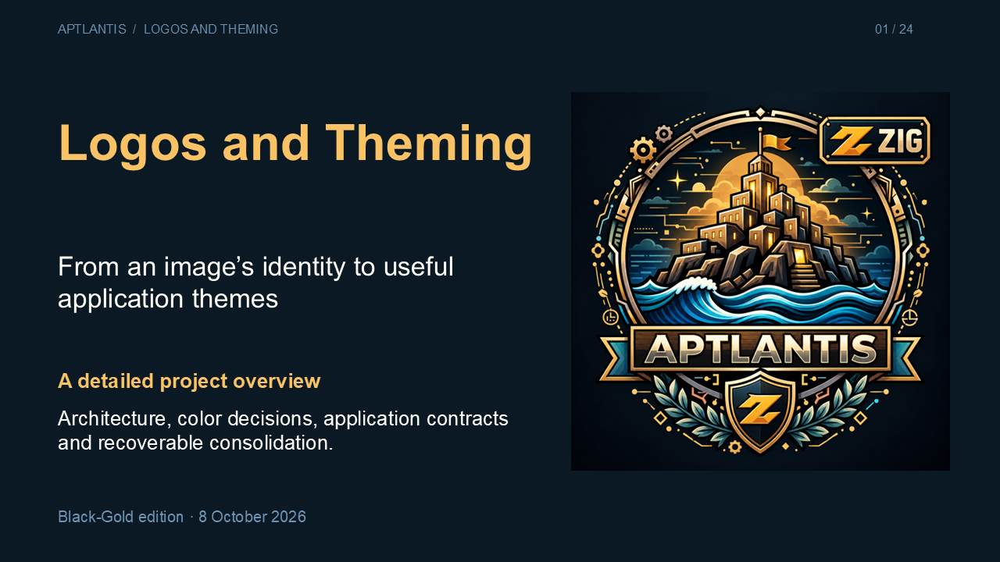

# Black-Gold project overview

[Logos-And-Theming-Overview.pptx](Logos-And-Theming-Overview.pptx) is the detailed 24-slide overview created on 8 October 2026. [The documentation suite plan](../documentation-suite/PLAN.md) specifies ten further volumes, with audiences, chapter outlines, sources, ownership, dependencies and acceptance criteria.

The presentation uses the exact twelve Office color slots from `output/blackgold/powerpoint/aptlantis-black-gold-sample.pptx`, its Arial typography and its 16:9 canvas. Its title artwork is the preserved `output/blackgold/source/apt-zig-dark-logo.png`. It does not regenerate the image or palette. The original sample, canonical values, application exports and historical migration records are unchanged.

The narrative covers ownership and consolidation, the six pipeline stages, specialist tools, extraction and transparency, observed representatives, canonical selection, semantics, derivation, dark surfaces, the four target contracts, provenance, CLI operation, converters, SESM, recovery and evidence limits. Twelve native tables and explanatory text are editable. Every slide has substantive speaker notes and hashed source references.

## Verification

Package relationships, slide count, layout, table ownership, reference typography and Artifact Tool import passed. The final package has no validator findings or layout warnings. Its twelve theme colors match the source sample exactly; all 32 canonical values shown on slide 9 match the existing palette. All 41 captured source hashes were checked after authoring.

The exact delivered deck opened in native PowerPoint with **repair disabled** and exported all 24 slides as 1280×720 PNGs. Every final slide was visually reviewed at full size. This is opening/rendering evidence, not a claim of manual edit/save/reopen acceptance or installation in any other application.

Detailed hashes and gates: [delivery.json](validation/delivery.json), [finalization.json](validation/finalization.json). Source catalog, slide content and notes: [overview-content.json](source/overview-content.json). The engine’s test results cited in the deck are dated existing evidence; this documentation task does not claim a fresh engine test run.

## Maintenance

The authoring sources are `source/prepare_overview.py`, `source/build_overview.mjs`, `source/finalize_overview.mjs` and `source/check_overview.py`. Run them from the project root with the project Python environment and the documented local Node/Artifact Tool runtime. The preparation step fails if a cited source is missing. It captures current hashes; read and review source changes before refreshing the deck.

Build into a private staging folder. Finalization intentionally refuses existing delivery or receipt paths; move an existing generated revision into a private review folder or choose fresh paths before rebuilding. Native PowerPoint checks must be executed separately, with repair disabled, and exported images must be inspected before recording visual acceptance. The validation script verifies those image files and records their hashes; file existence alone does not perform a visual review. Refresh the content source catalog only when its claims still agree with the reviewed code and records.

The future document suite is a plan. Authoring it, reconciling the existing Writerside snapshot and publishing documentation are subsequent tasks.
