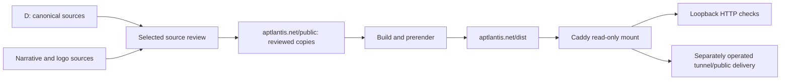

# Aptlantis A-drive workspace

This workspace contains the public City Hall website, its local static-serving setup, and supplied editorial material. City Hall is presented as a collection of useful standards, records, templates and tools that people can adapt one piece at a time. The website is an explanation and evidence layer; the canonical standards remain under `D:\.city_hall`.

**Reviewed 2026-10-02.** The Git working tree is rooted at `A:\`. The frontend project is `A:\aptlantis.net`, and the current Compose/Caddy configuration is `A:\webserver`. These locations are operational context for maintainers, not text to copy into public summaries or asset metadata.

| Location                                               | Role                                                                                          | Start here                                        |
| ------------------------------------------------------ | --------------------------------------------------------------------------------------------- | ------------------------------------------------- |
| `aptlantis.net/`                                       | React/Vite source, reviewed public data/assets, editorial tools and generated serving output. | [Site README](aptlantis.net/README.md)            |
| `webserver/`                                           | Caddy/Compose/tunnel configuration and retained infrastructure state.                         | [Webserver README](webserver/README.md)           |
| `Narrative-Pack/`                                      | Supplied explanation material; excluded by root Git ignore rules.                             | [Local narrative guide](Narrative-Pack/README.md) |
| `.git/`                                                | Shared version history for the A-drive source tree.                                           | Use Git from a project or the workspace root.     |
| `.pnpm-store/`, dependencies, build and OS directories | Tool caches, generated output or machine state.                                               | Not editorial sources.                            |

## Where to begin

Visitors unfamiliar with City Hall can start at `https://aptlantis.net/city-hall/find`: identify a familiar problem, narrow the situation, and inspect or download one suggested piece. The Walkthrough at `/walkthrough` explains the framework's operating model. The standards catalog at `/city-hall` explains individual responsibilities, while `/city-hall/resources` provides direct browsing. SVG Lab at `/svg-lab` offers a practical browser-local metadata workbench.

Maintainers should read the [site operating guide](aptlantis.net/AGENTS.md), then the README for the subsystem being changed. Use the site README for content, UI and build work; use the webserver README for serving, headers, routing and operational checks. The README files describe the inspected implementation; they do not replace canonical governance or project manifests.

## What is implemented now

The earlier summary-only standard pages have been expanded into authored explanations for all 16 components. Their catalog identity remains separate from edited explanations, detailed Markdown, approved examples and adoption guidance. The current teaching set contains 16 detailed Markdown files and 24 approved example assets with explicit illustrative/recorded classifications.

The four-chapter Walkthrough has stable URLs, section anchors, chapter navigation and synchronized Markdown. Home and the standards catalog retain compact component cards and SESM SVG logos containing embedded raster artwork. PNG compatibility assets remain available.

The website adopts Blue Slate v0.5.0 through a documented React/Tailwind site profile. Generated tokens, site adapters, operational reading layouts and known local deviations are recorded separately from the standard's candidate-active maturity. No new framework shell is required by the implementation.

The selected resource pack has 50 downloadable files across 14 catalog families. Each file has adaptation notes, a review date, relative provenance and a SHA-256 value. The earlier guided picker remains compatible with 28 outcomes. **Find the Part You Need** adds 25 broad problems, 24 reusable narrower families and 48 specific outcomes across 103 paths; guided navigation and natural-language search share the same records.

The pack's MIT notice permits modification and redistribution with its notice retained. It applies to the selected distribution, not to every canonical suite or repository asset. The visitor is free to remove fields, rename concepts, use one section or combine resources. Recommendations always connect to an existing selected download.

SVG Lab now runs XML/schema/safe-profile checks, metadata editing, explicit embedding/replacement, raster wrapping, comparison and exports in the browser. It uses a reviewed SESM 0.3.0 snapshot with 0.2.0 compatibility and keeps assets in memory. Its preview is isolated; validation and preview policy do not establish provenance, ownership, cryptographic authenticity or exhaustive sanitization.

The current production build writes 75 prerendered HTML documents, plus static bundles and public assets. SVG Lab and supporting/legacy React pages use the SPA fallback outside that count. Legacy projects remain available by direct links where retained, but they are outside the active City Hall discovery set.

## Source, review and serving flow



1. Inspect the exact named source files and current manifests deliberately.
2. Author a public explanation or select a sanitized artifact; retain ownership, classifications, dates and limitations.
3. Update the corresponding public JSON/Markdown/assets without mixing generated facts and curated content.
4. Run the smallest relevant checks, then the build and required browser regressions.
5. Verify local serving and perform a separate public-delivery check when publishing.

Normal builds consume committed public snapshots and do not read canonical drives. Source-refresh scripts and reference tests may intentionally read those drives. Production does not. The supplied directory tree and narrative packet are orientation inputs, not a current-state registry or permission to publish a whole canonical tree.

The currently inspected Compose file defines only Caddy, bound to `127.0.0.1:8100`. It mounts `A:\aptlantis.net\dist` and the Caddyfile read-only. Building replaces mounted static output and can affect locally served content; it is not an atomic deployment. Caddy configuration changes require a validated, deliberate reload. The tunnel configuration names the public domains, but it does not prove that a tunnel is running, DNS is correct or a public cache is fresh.

## Working commands

Run frontend commands in `A:\aptlantis.net`, using pnpm 10.15.0 and the committed lockfile:

```powershell
Set-Location 'A:\aptlantis.net'
pnpm dev
pnpm lint:strict
pnpm verify:resources
pnpm build
pnpm start --host 127.0.0.1 --port 4173 --strictPort
```

Use another terminal for checks against the running preview. The site README documents standard, Walkthrough, logo, finder and Lab verifiers, their ports and optional reference-test requirements. `pnpm import-all` refreshes database-backed content; it is not how the static City Hall pages are refreshed. Express and Rust commands are available for their separate subsystems and are not required for the current static explanation/resource pages or SVG Lab.

For read-only serving checks:

```powershell
Set-Location 'A:\webserver'
docker compose config --quiet
docker compose ps
docker compose exec caddy caddy validate --config /etc/caddy/Caddyfile --adapter caddyfile
curl.exe -I http://127.0.0.1:8100/city-hall/find
```

See the webserver README before changing mounts, reloading configuration, enabling services or maintaining persistent state. A documentation update does not require restarting containers.

## Maintenance map

| Work                                                       | Guidance                                                                                                                                     |
| ---------------------------------------------------------- | -------------------------------------------------------------------------------------------------------------------------------------------- |
| Standard explanations and examples                         | [Editorial workflow](aptlantis.net/docs/city-hall-standards-editorial.md), [source review](aptlantis.net/docs/standards/source-review.json). |
| Narrative and chapter Markdown                             | [Walkthrough workflow](aptlantis.net/docs/city-hall-walkthrough-editorial.md).                                                               |
| Resource selection, MIT scope and finder content           | [Resource editorial workflow](aptlantis.net/docs/city-hall-resources-editorial.md).                                                          |
| Component artwork and SESM metadata                        | [Logo workflow](aptlantis.net/docs/city-hall-logo-workflow.md).                                                                              |
| Browser SVG validation, preview policy and bundled sources | [Lab maintenance](aptlantis.net/docs/svg-lab-maintenance.md).                                                                                |
| Theme authority, adapter and coverage                      | [Blue Slate adoption](aptlantis.net/docs/blue-slate-adoption.md).                                                                            |
| Caddy, cache headers, local serving and persistent volumes | [Webserver operations](webserver/README.md).                                                                                                 |
| Earlier standard-page rollout design                       | [Historical sections plan](aptlantis.net/docs/standards-sections-plan.md); implemented status supersedes its summary-only opening.           |

## Verification and current boundaries

The [standard-detail acceptance record](aptlantis.net/docs/standards/acceptance-2026-10-01.md) documents all 16 teaching pages, copied example checks and separately dated local/public delivery observations. The [SVG Lab acceptance record](aptlantis.net/docs/svg-lab-acceptance-2026-10-01.md) documents ten reference fixtures, 49 extra engine checks and bounded browser-local workflows. The [finder verification record](aptlantis.net/docs/find-the-part-verification.md) documents all 103 paths, natural-language examples, saved history, typing, copy/download and responsive checks on 2026-10-02.

For this documentation refresh, Compose configuration and Caddy validation passed, the running Caddy mount/binding were inspected, and selected local routes, cache headers, Markdown behavior, a redirect, a retired-data response and a missing-bundle response were checked. These read-only observations are local evidence. No tunnel, DNS, public-hostname freshness, mail-delivery, database or Rust runtime check was performed for this refresh.

Known follow-up includes the webserver manifest's historical `D:\.dpw` location and broader service description, obsolete Markdown-negotiation routes, resource/finder public freshness checks, broader accessibility/browser coverage, and legacy TypeScript/formatting debt. The latest recorded full formatting check reported 302 files outside the finder change. Do not use broad reformatting to alter canonical byte-preserved snapshots.

## Workspace discipline

- Preserve exact physical names, stable slugs and compatible URLs. Rename only within an explicitly scoped change.
- Keep generated catalog facts, edited explanations, selected downloads, Lab snapshots and runtime reports separate.
- Preserve original bytes and notices where hashes/provenance depend on them; edit authoritative sources before regenerating translations.
- Do not publish credentials, private keys, private logs, personal exports or internal operational state as website assets.
- Keep `webserver/irc/` and persistent Docker volumes intact during routine site maintenance. Current Compose does not define an IRC service.
- Treat dependencies, `.tmp`, `dist`, IDE state and OS directories as generated/private context rather than teaching sources.
- Report what a check actually establishes. Build success, local HTTP delivery, dated public snapshot delivery and standard/adopter conformance are separate claims.
