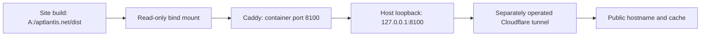

# Aptlantis Local Webserver

The local **Aptlantis Community** message board runs in an independent stack at [http://127.0.0.1:8110/](http://127.0.0.1:8110/). See [phpBB operations](phpbb/README.md) for its PHP/MariaDB services, registration policy, protected credentials, backups, and publication prerequisites. Its Compose project is separate from the website service described below; `forum.aptlantis.net` is reserved for a later launch.

This directory contains the active local Caddy static-serving configuration for the City Hall website and retained infrastructure material. The current Compose file defines one Caddy service. It serves the website's built public snapshots, resources and React routes; it does not run the frontend build, Express, MongoDB, the Rust service or IRC.

**Configuration and local runtime inspected 2026-10-02.** See the [A-drive overview](../README.md) for workspace boundaries and the [site README](../aptlantis.net/README.md) for capabilities, content ownership, build commands and acceptance records.

## Current service and files

| Item                                               | Current role                                                                                            |
| -------------------------------------------------- | ------------------------------------------------------------------------------------------------------- |
| [docker-compose.yml](docker-compose.yml)           | One `caddy` service using `caddy:latest`, container `caddy-aptlantis`, restart policy `unless-stopped`. |
| [Caddyfile](Caddyfile)                             | Port 8100, static root, compression, routing, discovery headers, content types and cache policy.        |
| [cloudflared-ingress.yml](cloudflared-ingress.yml) | Retained ingress mapping for `aptlantis.net` and `www.aptlantis.net`; not an active Compose service.    |
| [webserver.manifest.toml](webserver.manifest.toml) | Governance/service record with historical location and broader infrastructure descriptions.             |
| `irc/`                                             | Retained IRC configuration/state; no IRC service is defined in the current Compose file.                |
| Local tunnel logs and screenshot                   | Historical/operator context; not proof of current public runtime and not public site assets.            |

The Compose network is `aptlantis-network` with the bridge driver. Its exact runtime project-prefixed name should be inspected rather than guessed. The Caddy image uses the floating `latest` tag; the file is not an image-digest pin or a reproducible infrastructure-release record. Do not pull or replace it merely to refresh documentation or static content.

| Host/configured storage       | Container destination  | Access and purpose                                |
| ----------------------------- | ---------------------- | ------------------------------------------------- |
| `A:\aptlantis.net\dist`       | `/srv/aptlantis.net`   | Read-only static site build.                      |
| `A:\webserver\Caddyfile`      | `/etc/caddy/Caddyfile` | Read-only serving configuration.                  |
| Compose `caddy_data` volume   | `/data`                | Persistent Caddy data, read-write.                |
| Compose `caddy_config` volume | `/config`              | Persistent Caddy configuration state, read-write. |

The inspected container used `webserver_caddy_data` and `webserver_caddy_config` for those two named volumes. Verify actual names before any future backup or maintenance because Compose project naming can vary. Preserve retained `irc/` content and any historical service volumes; their absence from this Compose file does not authorize deleting them.

## Network and publication boundary



Compose publishes `127.0.0.1:8100:8100`, not a general host-interface binding. The retained tunnel ingress targets `http://localhost:8100` for both public hostnames and has a final HTTP-404 catch-all. The tunnel is operated separately; its configuration alone establishes neither a running tunnel nor correct DNS/public delivery.

No API reverse proxy exists in the inspected Caddyfile. The website's browser-local SVG Lab requires no API. Contact submission, database-backed features and optional Rust endpoints need separately configured services/routing and their own verification. Retained mirror handlers also require content mounts that this Compose file does not supply.

## Static routing and cache behavior

The root is `/srv/aptlantis.net`, with gzip and zstd encoding. Generic static routing tries `{path}/index.html`, then `{path}`, then `/index.html`. The site currently builds 75 route-specific City Hall documents. SVG Lab and supporting/legacy React pages use the SPA fallback outside that document count.

| Request class                                                                            | Configured behavior                                                                                                                      |
| ---------------------------------------------------------------------------------------- | ---------------------------------------------------------------------------------------------------------------------------------------- |
| Home, City Hall and Walkthrough routes, SVG Lab and listed supporting/legacy HTML routes | `Cache-Control: no-store, max-age=0` and `Cloudflare-CDN-Cache-Control: no-store`.                                                       |
| `/assets/*` hashed bundles                                                               | `public, max-age=31536000, immutable`; static file lookup only. Missing bundles return 404 rather than fallback HTML.                    |
| Existing explicit Markdown files                                                         | `text/markdown; charset=utf-8`. Their cache policy also depends on the path matcher; City Hall Markdown paths fall under `/city-hall/*`. |
| `/llms.txt`                                                                              | `text/plain; charset=utf-8`.                                                                                                             |
| `/.well-known/api-catalog`                                                               | `application/linkset+json; charset=utf-8`.                                                                                               |
| Named OAuth/agent-skill metadata files                                                   | Explicit JSON content types; static discovery material, not authentication endpoints.                                                    |
| Listed legacy project/lab paths                                                          | `X-Robots-Tag: noindex, follow`.                                                                                                         |
| `/project/cityhall`                                                                      | HTTP 308 redirect to `/city-hall`.                                                                                                       |
| `/data/projects/portfolio.json` and `/data/projects/cityhall-frameworks.json`            | HTTP 410 `Gone`.                                                                                                                         |
| Other missing paths                                                                      | May fall back to Home HTML with HTTP 200; a 200 alone does not prove that the requested resource exists.                                 |

HTML and bundles have different cache responsibilities: a fresh HTML document must not keep referring to a removed hashed bundle. The configuration prevents missing asset requests from quietly receiving HTML, but it does not make a build an atomic rollout or control every upstream cache. Generic public JSON/resource URLs do not all inherit a dedicated cache rule. Public resource freshness must be checked against the expected snapshot after publication.

### Markdown and discovery

Home advertises discovery URLs in `Link` headers and varies on `Accept`. `Accept: text/markdown` at `/` serves `/index.md`. Explicit current Markdown resources include:

- `/city-hall/components/<slug>.md`: manifest-summary explanations.
- `/city-hall/standards/<slug>.md`: authored standard explanations.
- `/city-hall/walkthrough/<chapter>.md`: synchronized narrative chapters.
- `/city-hall/resources/README.md`: selected pack guide.
- `/auth.md`: current anonymous-access and authentication boundaries.

The current Caddy matcher also rewrites Markdown requests for `/concepts`, `/standards`, `/resources` and `/reference` to corresponding `.md` files. Some are historical paths with absent files. The 2026-10-02 local `/concepts` Markdown request returned 404. `/city-hall/pps` with the same Accept header remained HTML: it does not negotiate to the detailed standard Markdown automatically. Use the explicit URLs above and do not describe these historical rewrite rules as universal content negotiation.

`sitemap.xml`, `llms.txt`, `/data/manifest.json` and `.well-known` files are public discovery surfaces. Published auth metadata advertises no protected public API, OAuth registration or issued agent credential. Their file presence is not proof that a corresponding network service is deployed.

### Retained mirrors and IRC

The Caddyfile still contains browsing handlers for `/crates.io/*`, `/crates.io-index/*` and `/rustup/*`, pointing at `/srv/rust-lang/...`. Current Compose mounts only the website and Caddy state/configuration, so those mirror handlers lack the advertised content mounts. They must not be presented as functioning mirrors based on route definitions alone.

The physical `irc/` directory remains separate from the static website. Current Compose starts no Ergo or TheLounge service. Do not publish its credentials, certificate/private-key files, logs or databases, and do not delete them as part of frontend or documentation work. The service manifest's broader IRC description is retained historical context, not current Compose inventory.

## Operator workflows

### Inspect before changing

From this directory:

```powershell
Set-Location 'A:\webserver'
docker compose config --quiet
docker compose ps
docker compose exec caddy caddy validate --config /etc/caddy/Caddyfile --adapter caddyfile
docker inspect caddy-aptlantis --format '{{json .Mounts}}'
```

These checks inspect/validate configuration and state; they do not reload the running Caddy configuration. Validation parses the mounted file, while runtime HTTP checks establish the active request behavior. When investigating failures, use bounded service logs:

```powershell
docker compose logs --tail 100 caddy
```

Review logs locally before sharing them; URLs and infrastructure context can be private. The inspected Caddyfile has no explicit access-log configuration, so container logs are not guaranteed to contain a complete request audit trail.

### Update static website content

1. Make source/data changes in `A:\aptlantis.net`, following its operating guide and editorial workflow.
2. Run the relevant resource/snapshot checks, lint and production build. Inspect generated output and browser behavior.
3. Verify the intended routes and bytes through local Caddy.
4. If the local service is publicly exposed by the separate tunnel, verify the intended public hostname and cache freshness independently before recording publication success.

The existing mount sees changed build files without requiring a Caddy restart. Building directly into the mounted `dist` directory can expose incomplete/transitional output during the build; the current workflow has no atomic release-directory switch. A production rollout should account for that operational limitation. A documentation-only edit needs neither a build nor a service reload.

### Update Caddy configuration

Edit only the intended rules, validate the mounted file, then deliberately reload it:

```powershell
docker compose exec caddy caddy validate --config /etc/caddy/Caddyfile --adapter caddyfile
if ($LASTEXITCODE -ne 0) { throw 'Caddy validation failed; do not reload' }
docker compose exec caddy caddy reload --config /etc/caddy/Caddyfile --adapter caddyfile
```

Check the reload exit code and repeat local HTTP checks. File edits do not demonstrate that runtime configuration changed. Mount/port/image changes belong to a separate Compose operation; an authorized `docker compose up -d caddy` can recreate that service as needed. Do not use stack teardown or volume deletion for routine changes.

### Check delivery

```powershell
curl.exe -I http://127.0.0.1:8100/
curl.exe -I http://127.0.0.1:8100/city-hall/find
curl.exe -I http://127.0.0.1:8100/city-hall/standards/pps.md
curl.exe -I http://127.0.0.1:8100/assets/missing-build-hash.js
curl.exe -I http://127.0.0.1:8100/data/projects/portfolio.json
curl.exe -I -H 'Accept: text/markdown' http://127.0.0.1:8100/
```

Expected results include fresh HTML headers, explicit Markdown at the named file URL, 404 for the deliberately missing asset, 410 for retired portfolio data, and Markdown negotiation at Home. Check canonical metadata, a distinctive page section, and actual file bytes/hashes where appropriate; HTTP 200 by itself is insufficient because of the SPA fallback.

From the site directory, the broader hosting verifier is:

```powershell
Set-Location 'A:\aptlantis.net'
node scripts/verify-city-hall.mjs
```

It defaults to local Caddy at 8100 and checks Caddy-specific behavior plus browser routes. The Walkthrough, logo and standard verifiers default to a built Vite preview at 4173, with `CITY_HALL_TEST_ORIGIN` available for another origin. The finder verifier manages its own preview on 4181. See the site README for required runtime/reference dependencies and exact coverage.

## Troubleshooting and follow-up

| Symptom                                         | Inspect                                                                                                                          |
| ----------------------------------------------- | -------------------------------------------------------------------------------------------------------------------------------- |
| Old page copy                                   | Current `dist` bytes, canonical page metadata, local headers, then public tunnel/cache behavior separately.                      |
| A script URL returns HTML                       | Confirm `/assets/*` is handled before the SPA fallback and that HTML/bundle versions belong to the same build.                   |
| Local route returns 200 but wrong content       | Check the requested file and route-specific document; generic fallback may have served Home.                                     |
| Resource Copy is disabled or reports a mismatch | Compare catalog SHA-256 with selected/public/served bytes and check freshness; do not change the recorded hash to conceal drift. |
| New source edits do not appear                  | Source is not the served directory; build output, mounts and active origin must agree.                                           |
| Contact/API request fails                       | The current Caddy setup has no backend proxy; verify the separately configured service and routing.                              |
| Markdown route returns 404                      | Use explicit current `.md` URLs; inspect historical rewrite paths and their files.                                               |
| Mirror/IRC endpoint is unavailable              | Current Compose does not supply mirror content or start IRC services.                                                            |
| Public differs from local                       | Inspect tunnel/DNS/upstream caching using the operator's separate infrastructure workflow.                                       |

`webserver.manifest.toml` still names `D:\.dpw\webserver`, a historical parent and broader Caddy/Ergo/TheLounge infrastructure. The inspected A-drive files and running mounts establish the current serving shape. Reconciling governance/location records is follow-up work; this README update changes no manifest, tunnel, DNS, ports, mounts or persistent state.

## Verification recorded for this refresh

On 2026-10-02, `docker compose config --quiet` passed, Compose reported the Caddy container running with the loopback binding, Caddy validation passed, and the website/Caddyfile mounts were confirmed read-only. The persistent volume names listed above were read from the running container.

Bounded HTTP checks returned 200 for Home, finder, resource catalog, earlier picker, PPS, Walkthrough, SVG Lab, the PPS detailed Markdown and pack MIT notice. Listed HTML responses carried the configured no-store header. A deliberately missing bundle returned 404, retired portfolio data returned 410, and `/project/cityhall` returned 308 to `/city-hall`. Home Markdown negotiation worked; `/concepts` Markdown returned 404; PPS remained HTML under a Markdown Accept header. These observations document local serving behavior, not rendered-browser acceptance for every route.

The site [standard acceptance record](../aptlantis.net/docs/standards/acceptance-2026-10-01.md) contains separate dated public snapshot checks. The newer [resource record](../aptlantis.net/docs/city-hall-resources-editorial.md) and [finder record](../aptlantis.net/docs/find-the-part-verification.md) establish local implementation evidence without public freshness claims. No container restart, Caddy reload, image pull, tunnel/DNS change, public-hostname check, mail submission or persistent-state modification was performed for this README refresh.
